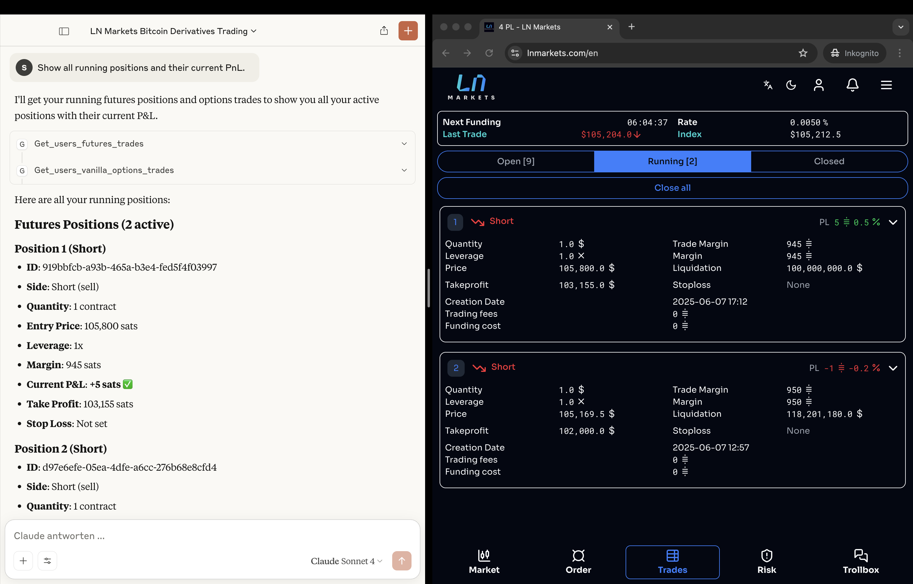

# LN Markets MCP – Proof of Concept

This repository contains a minimal **Model Context Protocol (MCP)** server written in C# / ASP.NET Core.  
The server wraps the LN Markets REST API as MCP tools so that any LLM client (e.g. Claude, OpenAI Assistant) can trigger trades or query account data with plain‑language prompts.

## Quick start

```bash
git clone https://github.com/slekrem/LnmMcpPoc.git
cd LnmMcpPoc
dotnet restore
```

Edit **`appsettings.json`** and insert your LN Markets credentials:

```jsonc
{
  "LnMarkets": {
    "ApiKey": "YOUR_API_KEY",
    "Secret": "YOUR_SECRET",
    "Passphrase": "YOUR_PASSPHRASE",
    "BaseUrl": "https://api.testnet4.lnmarkets.com/v2"
  }
}
```

## Claude Desktop integration

To launch the MCP server directly from Claude Desktop, extend **`claude_desktop_config.json`** (macOS default path:  
`~/Library/Application Support/Claude/claude_desktop_config.json`) with an entry like this:

```jsonc
{
  "mcpServers": {
    "LnmMcpPoc": {
      "command": "/usr/local/share/dotnet/dotnet",
      "args": [
        "run",
        "--project",
        "/Users/<your‑username>/Documents/GitHub/LnmMcpPoc/LnmMcpPoc/LnmMcpPoc.csproj"
      ],
      "cwd": "/Users/<your‑username>/Documents/GitHub/LnmMcpPoc/LnmMcpPoc",
      "transport": {
        "type": "stdio"
      }
    }
  }
}
```

> Replace **`<your‑username>`** with your macOS account name and adapt the paths if you cloned the repo elsewhere.

After saving the file, restart Claude Desktop.  
The server will show up under **MCP Servers → LnmMcpPoc** and can be started with one click.

## Demo screenshots & sample prompts

Below is a mock-up of how a complete workflow looks: Claude Desktop on the **left**, LN Markets on the **right**.

| Claude Desktop & Ln Markets                    |
| ---------------------------------------------- |
|  |

Try these prompts to showcase the key features:

	1.	Create a limit-buy order 1 USD @ 60000 USD with 5× leverage
	2.	Show all running positions and their current PnL
	3.	Add 20000 sats margin to my running trade
	4.	Cancel all pending orders
	5.	Fetch the last hour of OHLC data for BTC/USD in 1-minute granularity
	6.	Withdraw 50000 sats to Lightning address lnbc1…
	7.	Set a take-profit at 65000 USD on trade #123456

## License

MIT — see [LICENSE](LICENSE).

---

© 2025 slekrem
